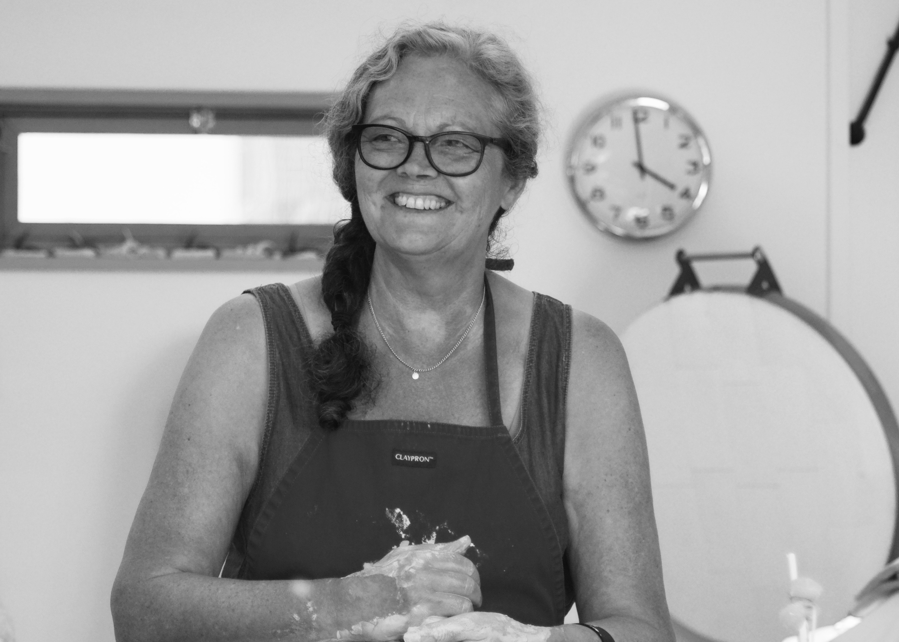

  

    

      

        <h3>About</h3>
        

        
Ceramic designer based in St Ives, Cornwall.

        
Studied ceramics at Loughborough College of Art and has a BA in Three Dimensional Design.

        
Co-founder of the ceramic studio DOR & TAN.

        
Collaborator, and has worked with Origin Coffee Roasters and eco chef Tom Hunt.

        
Supporter of Surfers Against Sewage and is a member of the SAS 250 Club.

        
Her work is deeply rooted in rustic minimalism and interpretation of
          the Cornish landscape. She uses Korean pottery for context in form,
          and eco philosophy in making practices. Using her studies as a way to
          broaden hers and hopefully others minds in the possibilities of hand
          thrown ceramics to be used functionally everyday. 

        

      

    

    

      
    

  

