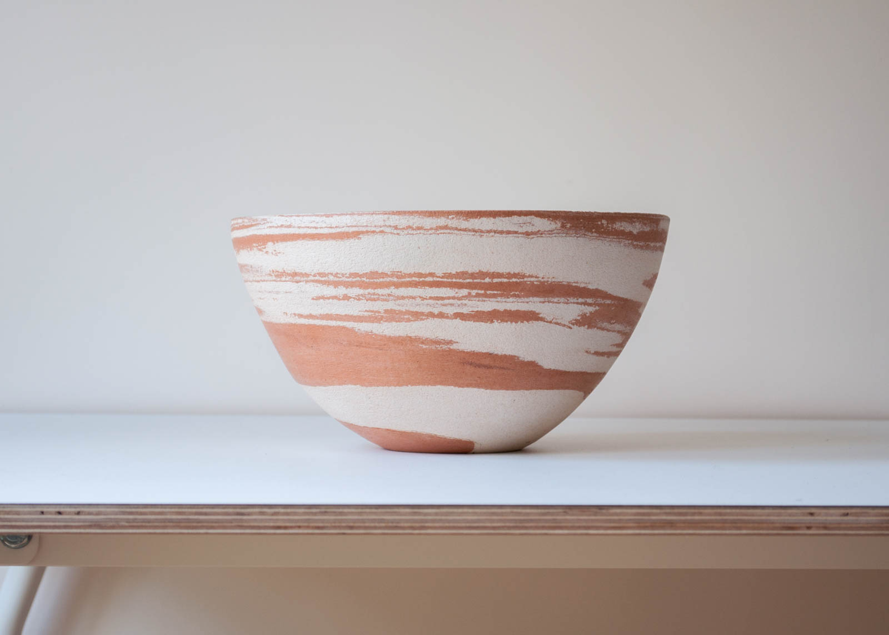
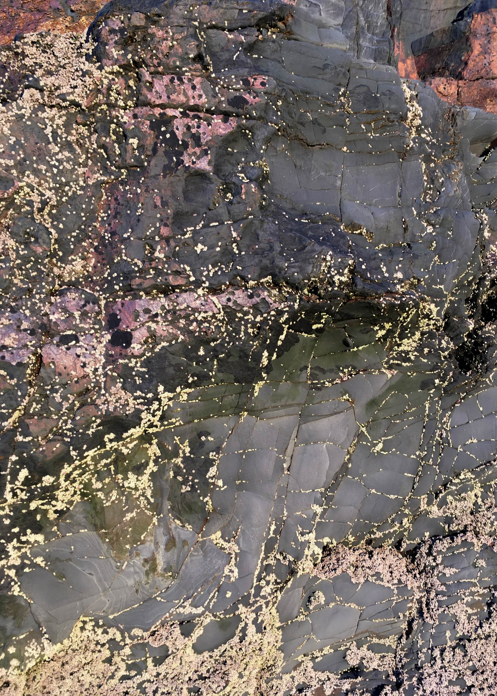
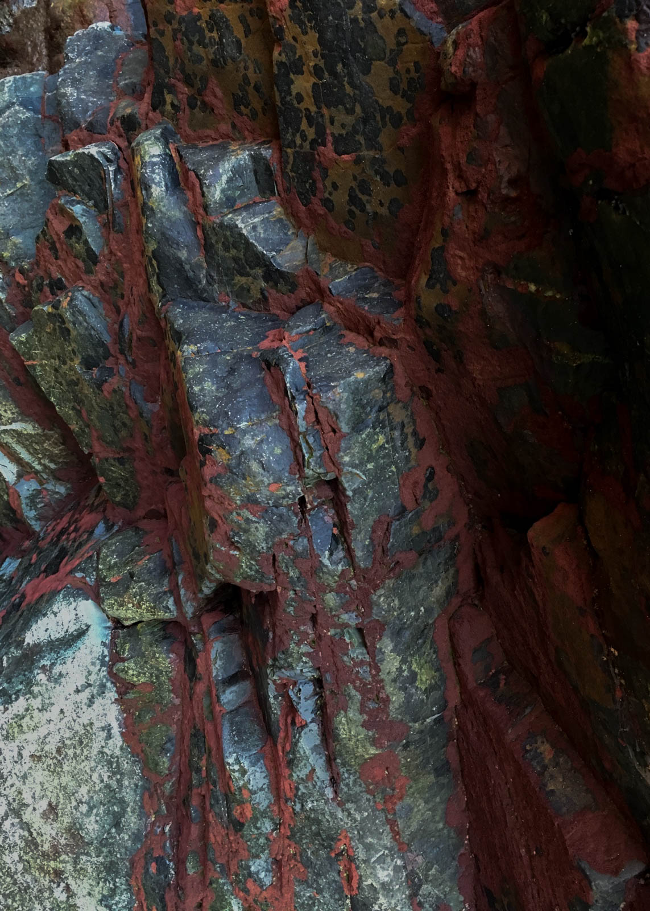
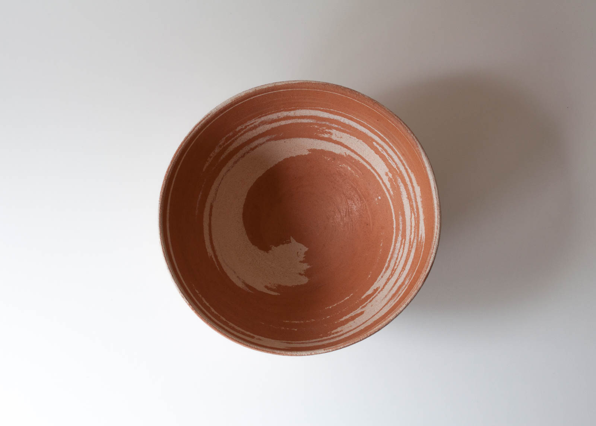
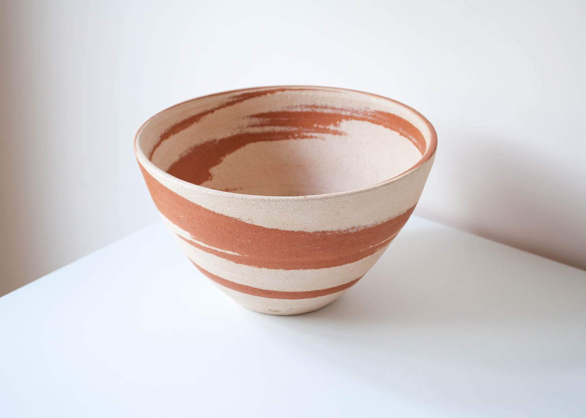
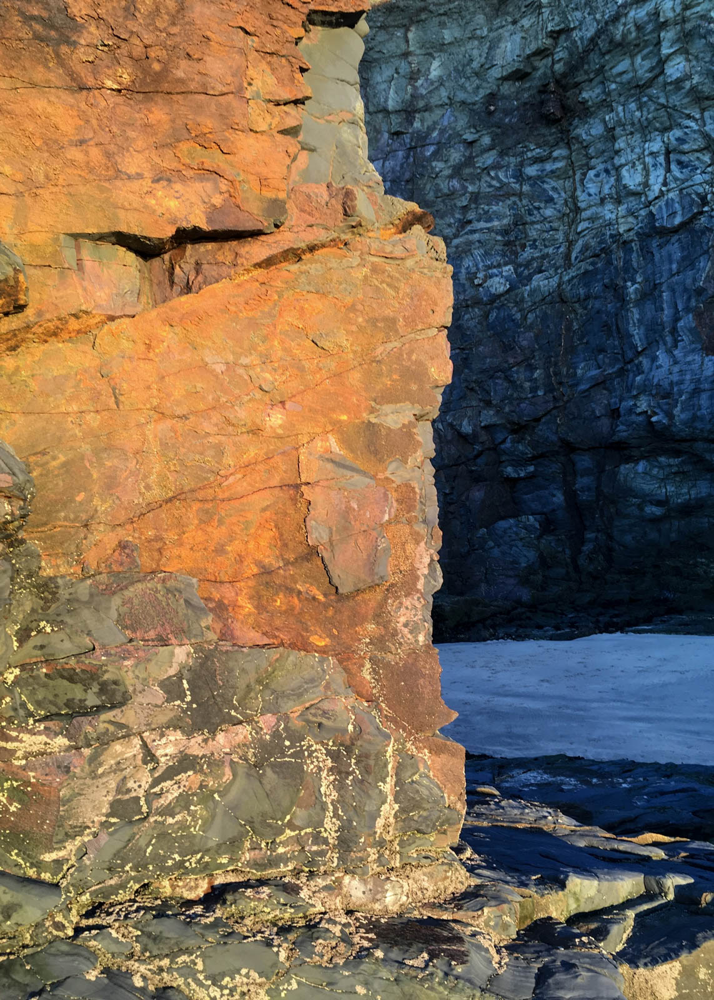
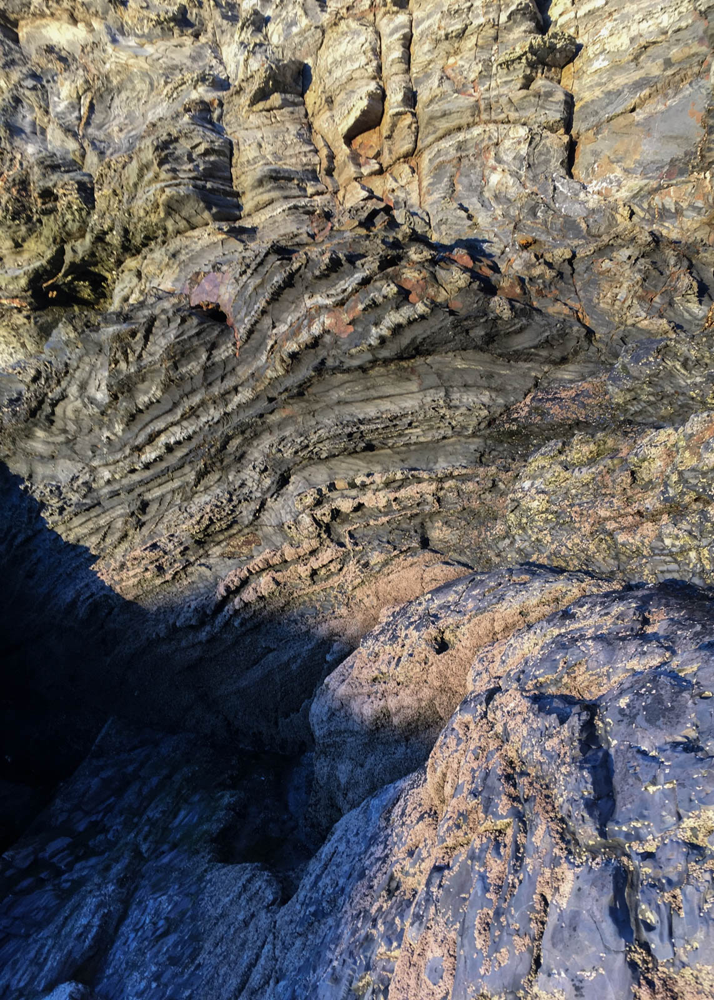

  

    

      

        <h3>Dune Bowl</h3>
        

            
The layering of different minerals and sediments is a beautiful
              phenomenon to behold. Being near the coast, I am fortuitous enough
               that I’m greeted with this natural occurrence everyday. Whether it’s
                isolated rock masses on beaches, tall, towering cliff edges or
                soft, sandy dune grass mounds that have been cut into like cake
                by the wind. All very different in appearance some subtle and
                others more dramatic and imposing. 

            
The Dune Bowl emerged from two types of clay, with pigments close
               to the sand and soil that I found at Gwithian Dunes. Crushed and
               layered together akin to how strata is formed. Pulled up high
               like a cliff then eroded away by my hands and tools to reveal the
                patterns and textures beneath. The creation of this piece to me
                 is a reminder of how powerful and graceful a sculptor the
                 natural elements are.

        

      

    

    

      
      

        

        

      

      
      
      

        

        

      

    

  

