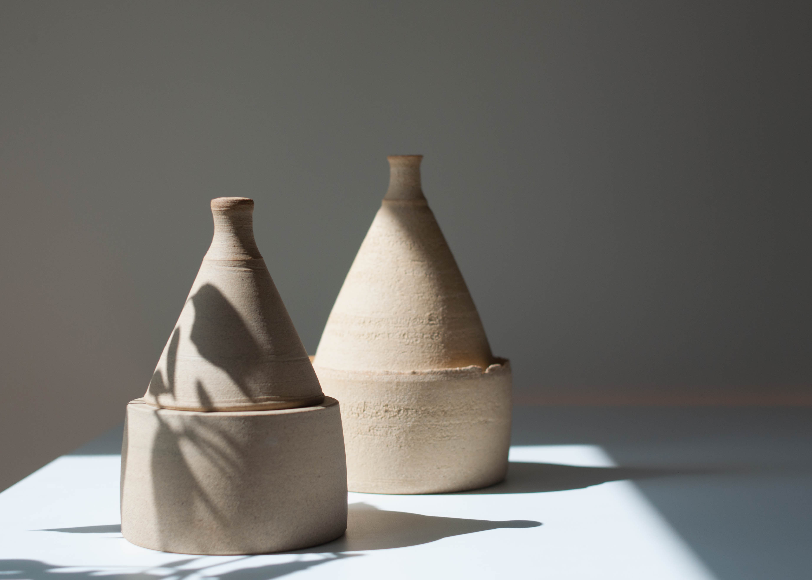
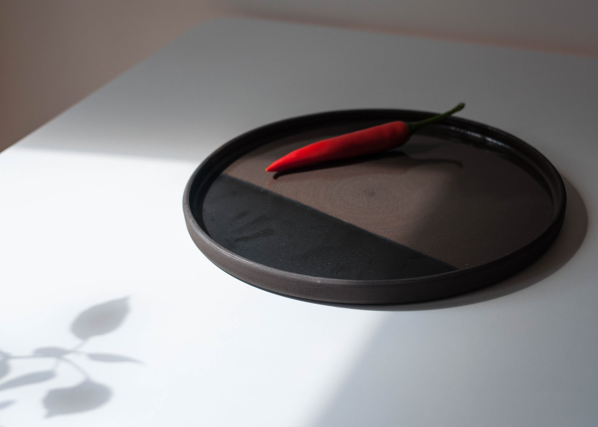
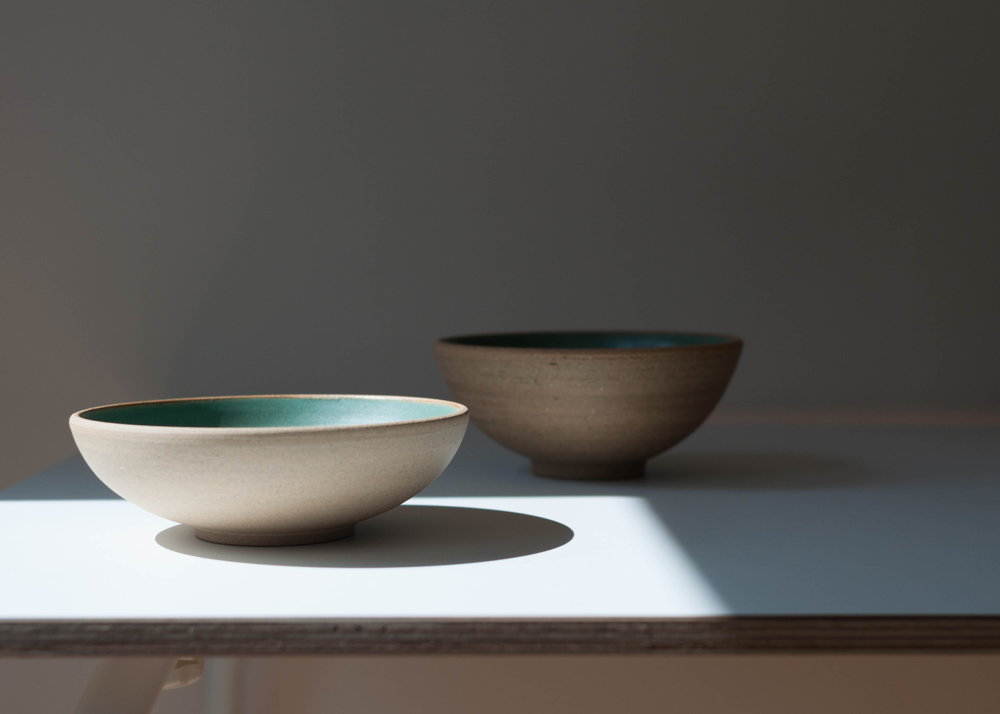
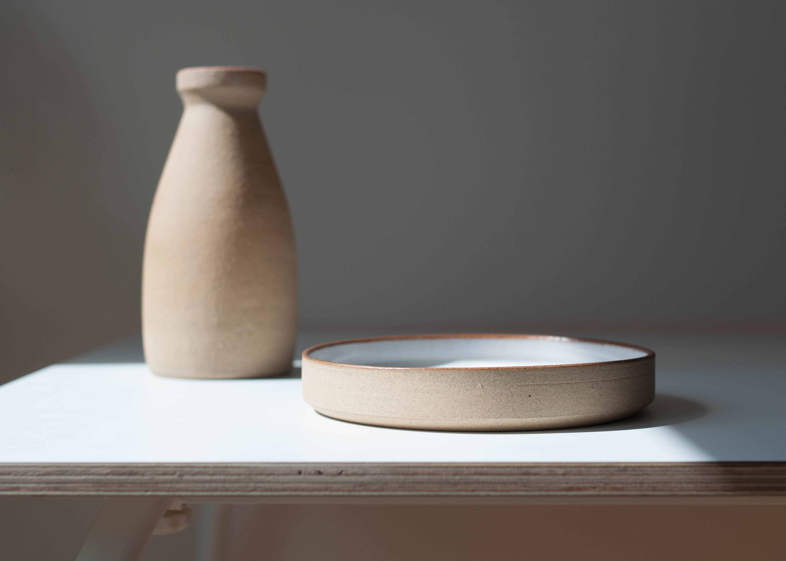
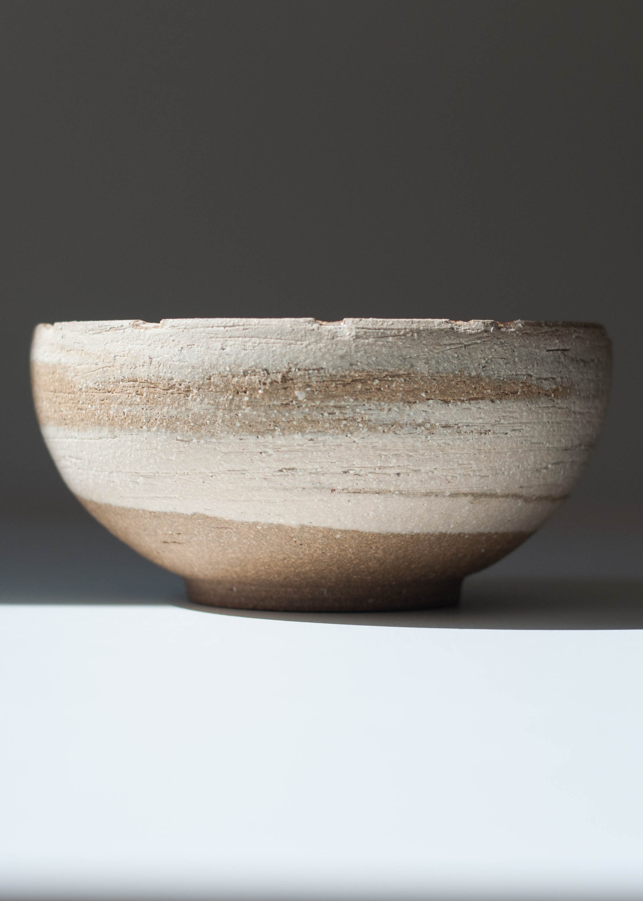
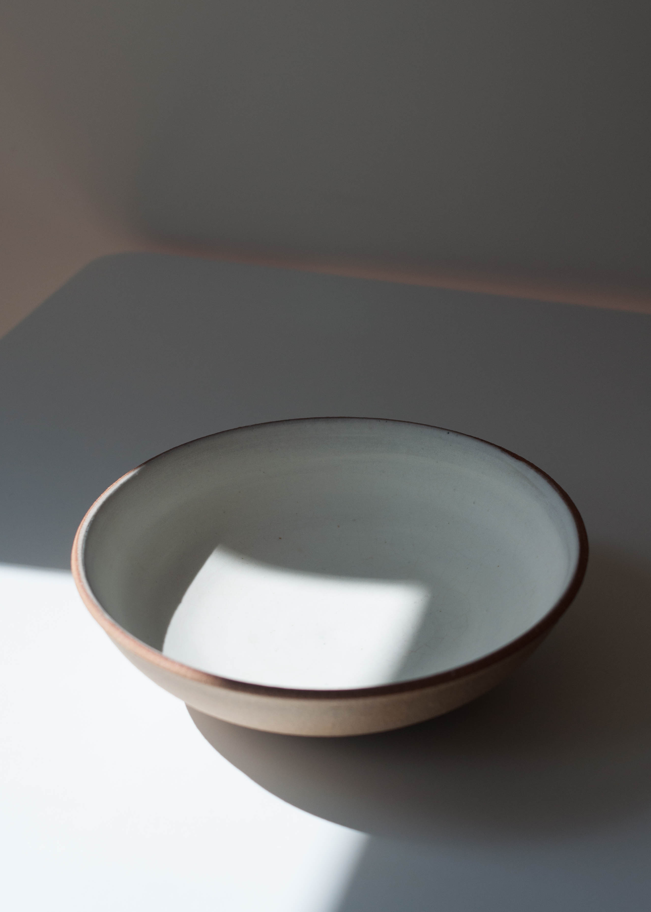
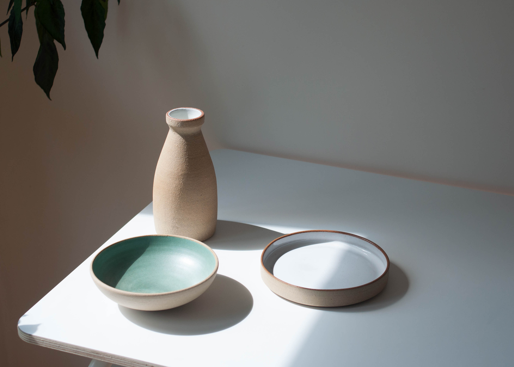
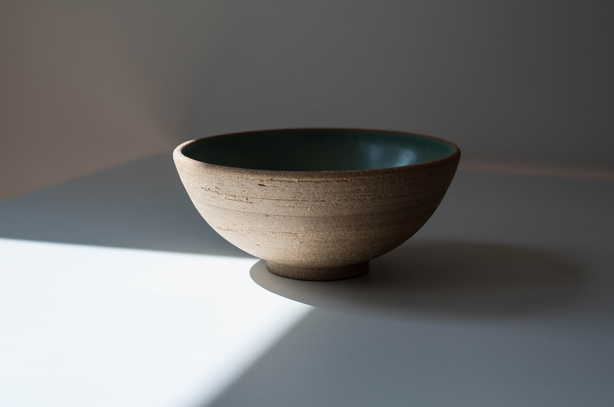
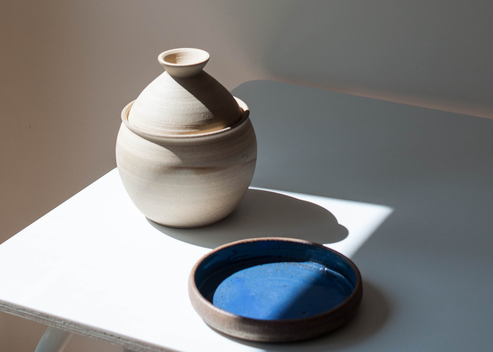

  

    

      

        <h3>Five Element Designs</h3>
        

            
Tom Hunt, eco-chef, and writer of The Natural Cook organised an
              event in London where he would be creating a menu based on the
              five Chinese elements. He asked for me to collaborate with him by
              designing a collection of bespoke objects to serve his courses
              upon.

            
These are the objects made prior to the Five Element Feast,
              before refinement for their later purpose. I focused on form and
              texture with this project, avoiding engrossing myself with
              glazing, as glaze can sometimes be an unwanted distraction.

            
I played around with a variety of clays, testing ways to
              exaggerate their smooth and groggy properties, but also linking
              the surface to shape. How much surface area should be on show to
              balance the coarseness? Or should the lines of a form be
              overstated and sharpened to compliment the smoother clays?

            
After finding the harmonies I favoured the most, I moved onto
              glazing. Minimal tones, white, transparent and celadon, which
              ranged from polished looking to matte. These colours strengthened
              the aesthetics of the object without detracting from their other
              features. One item Tom asked for was a serving plate, for this I
              felt as if the amount of surface gave an opportunity to use slip
              and sgraffito to create subtle lines on the circular expanse.

        

      

    

    

      
      
      
      
      

        

        

      

      
      
      
    

  

