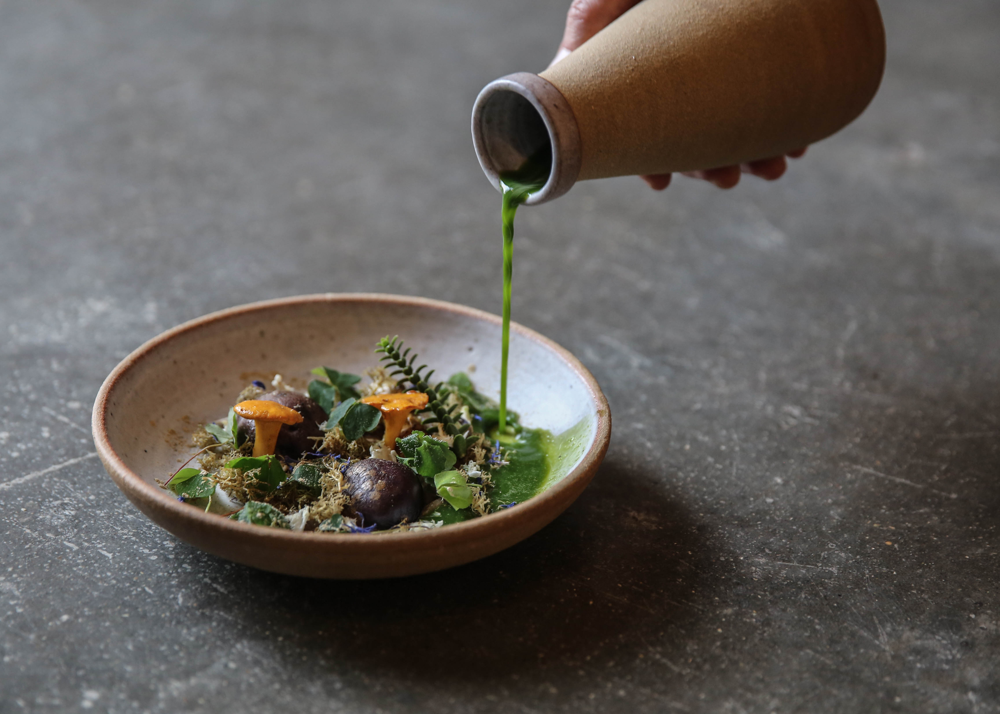
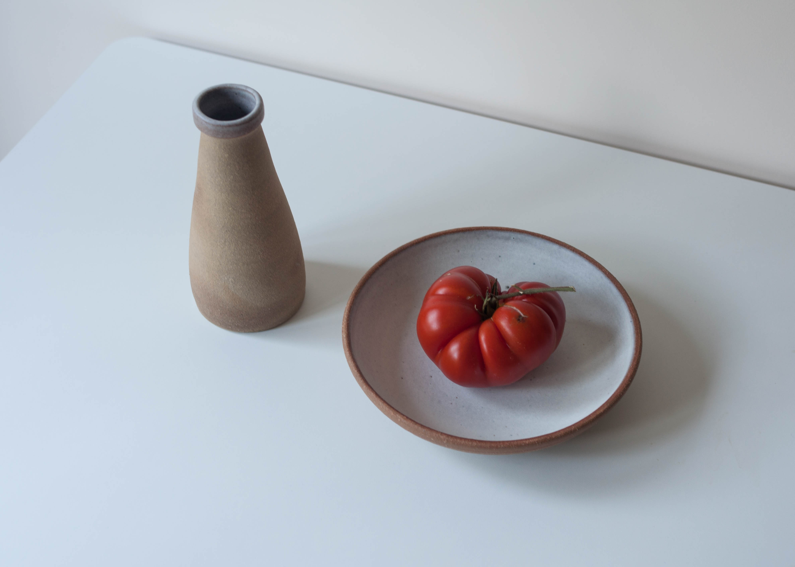
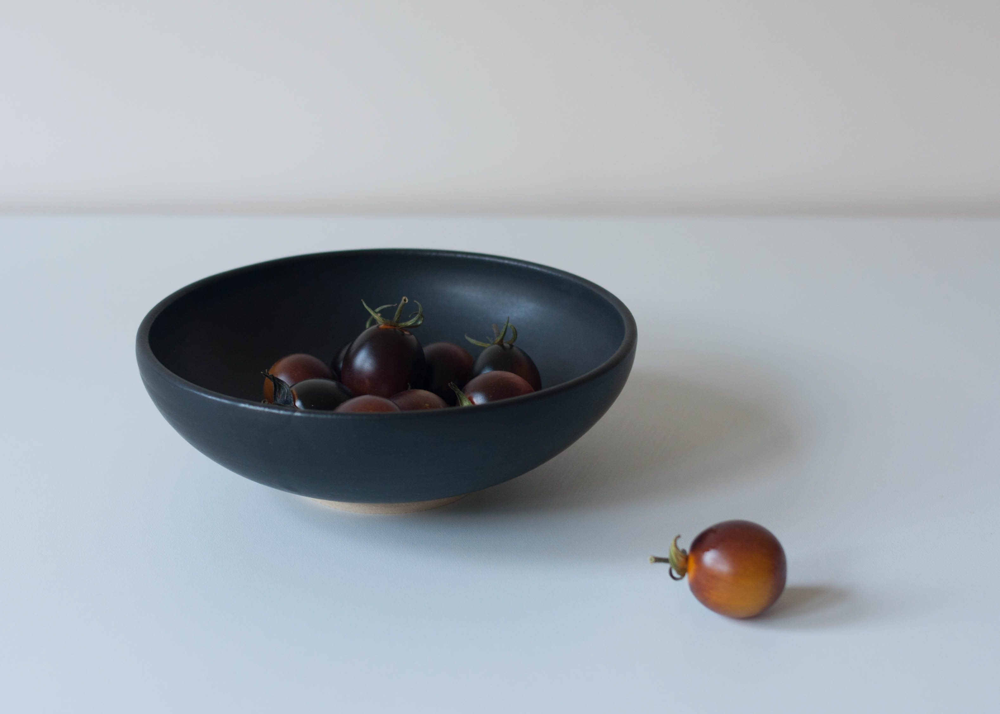
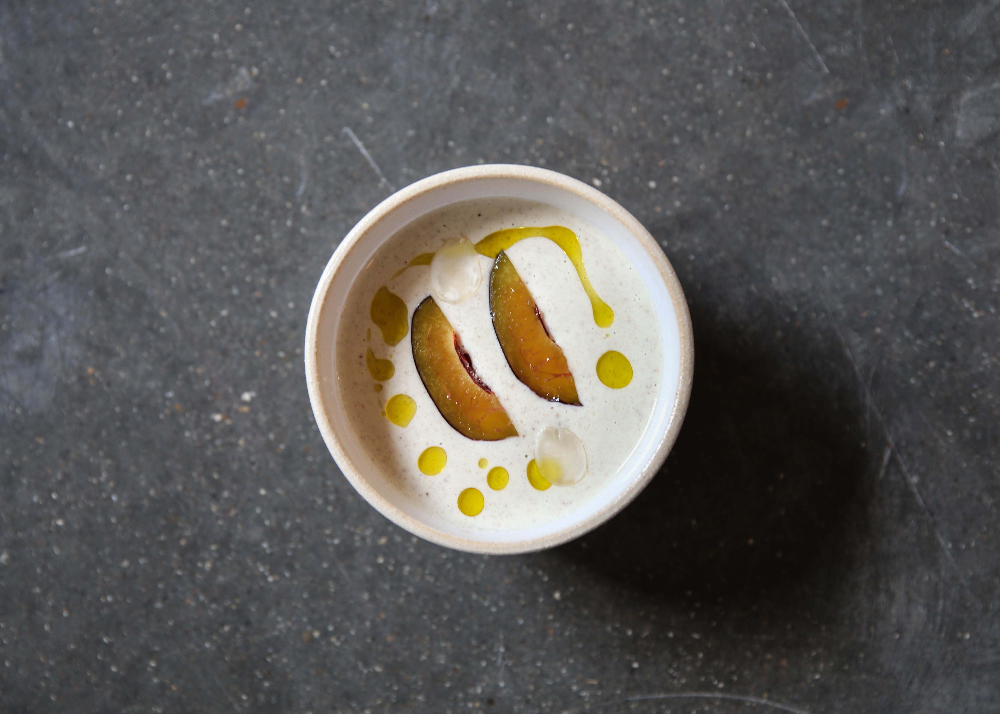
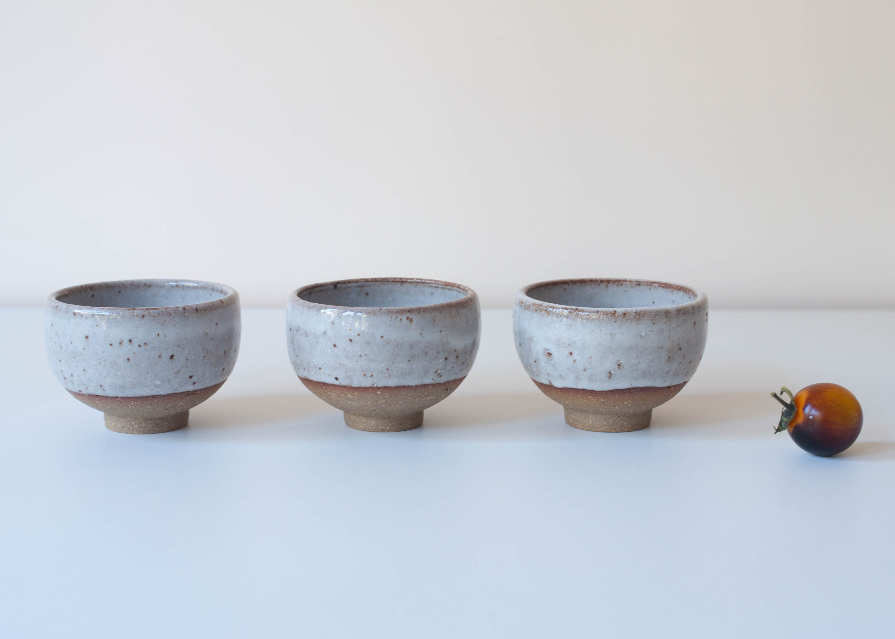
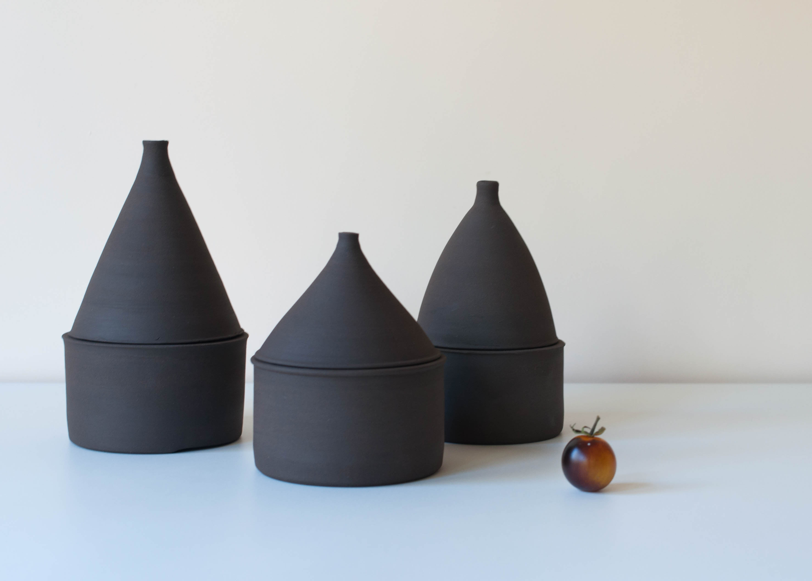
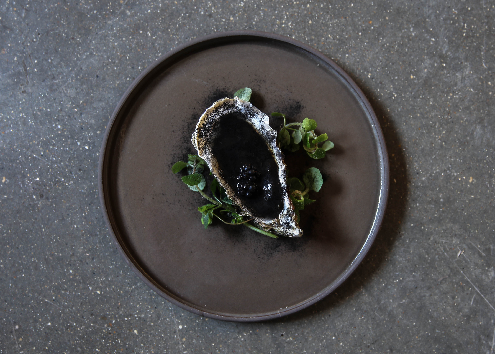
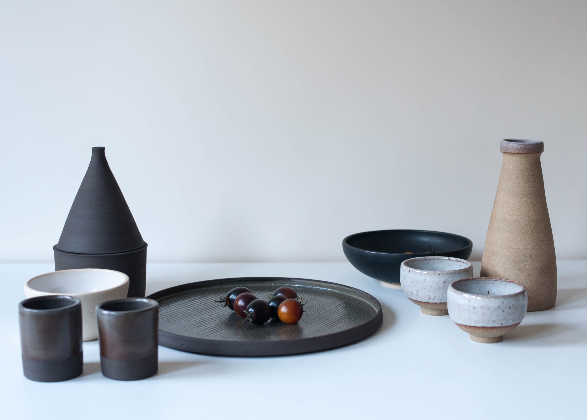

  

    

      

        <h3>Five Element Feast</h3>
        

            
For this collection, I collaborated with Tom Hunt, a chef
              dedicated to eco cooking or root to fruit as he calls it, a method
               where no part of the food is wasted. Nature is always a leading
               element in my work, and collaborating with Tom broadened my view
               on how to further a person's connection to food through ceramics.

            
The basis for the meal was the five Chinese elements, with each
              course representing Earth, Water, Fire, Metal, and Wood. These
              natural subjects had to be reflected in the food as well as the
              ceramics, regarding hue, surface, and profile. The meal had to
              compliment the plate and vice versa in a harmonious balance.

            
The project was based predominantly on experimental work, which
              was later refined and distilled to accentuate Tom's culinary
              vision. Choosing the forms that displayed and held liquids
              especially aesthetically,  contrasting ingredients against
              different clays and developing further those which were most
              striking. With some of the vessels, I felt the need to try
              something a bit offbeat, different to what would habitually
              be seen at the dinner table.

            
The Temple was created for Fire, and naturally, as a potter, I
              thought of kilns, lids, an object to be opened and behold what is
              nestled inside. When I showed Tom the form, he instantly asked
              for black clay and a red interior. This was to conflict with the
              white yogurt but also to further foster the effect of red, burnt
              strawberries. To supplement the experience of sight and touch was
               the most sensuous part of the experience,  singed bay leaves.
               These were placed inside resulting in an indulgence of fragrance
               and smokey visuals when the lid was opened.

            
Being involved in this project, I’ve learned many of the aspects
              in which ceramics and food coexist. Ceramics are not just a
              stationary object, purely based in a still moment, they can be
              kinetic. Food is an act, and ceramics are the stage and context.
              When observed in this way, the possibilities become more
              intriguing to discover, and another lid is opened.

        

      

    

    

      
      
      
      
      
      
      
      
    

  

