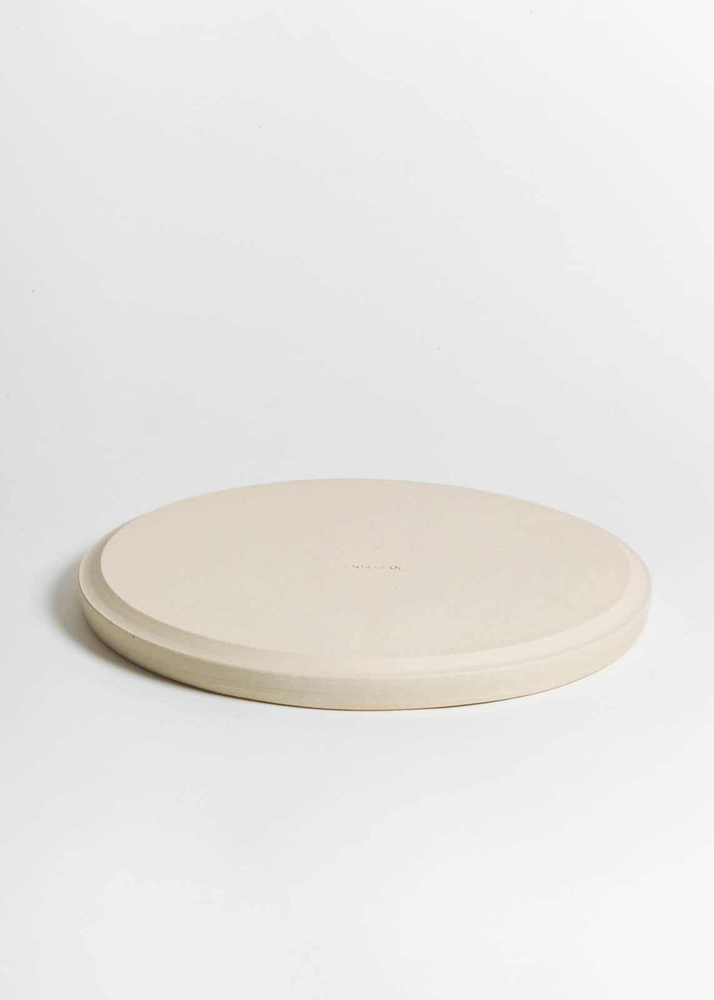
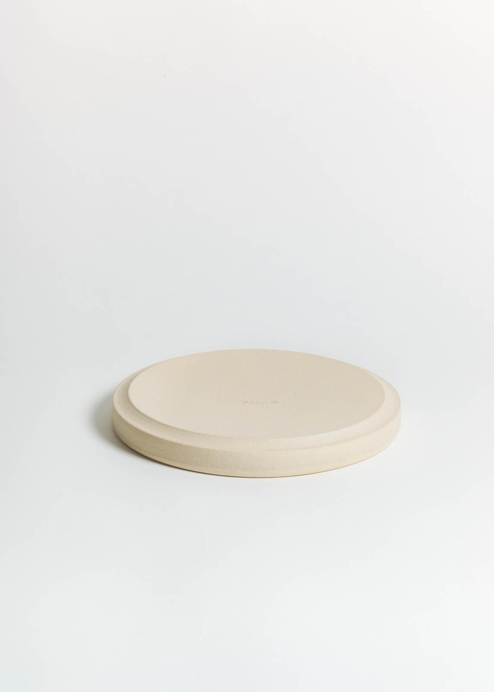

  

    

      

        <h3>Strata Plates</h3>
        

            
The Strata plates were inspired when talking to a local chef and
              his wife at my studio. The family currently run a small restaurant
              just down the hill from me, with the beach at their doorstep. They
              were looking for a design that would be easy to care for, travel
              with and store. The design anchor points I worked around for the
              plates was minimalism, functionality and tactility.

            
The approach had to be simple for stacking effect to work and
              avoid compromising the objects form. I decided to define a large
              foot  for each plate with the edge turned away just  enough to be
              able to sit inside the rim of the previous.

        

      

    

    

      
      

        

        

      

      
      
      
      

        

        

      

      
    

  

