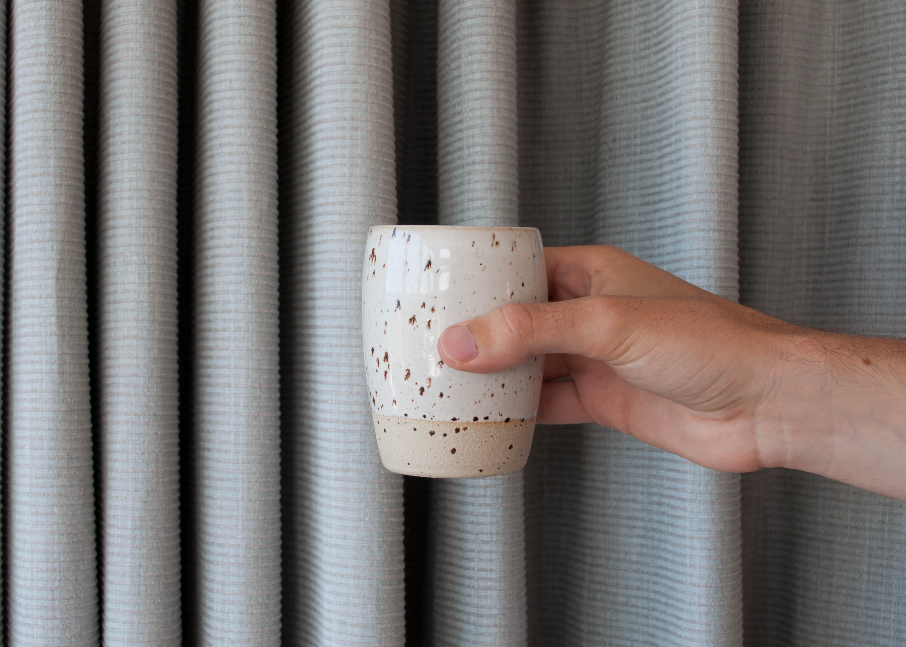
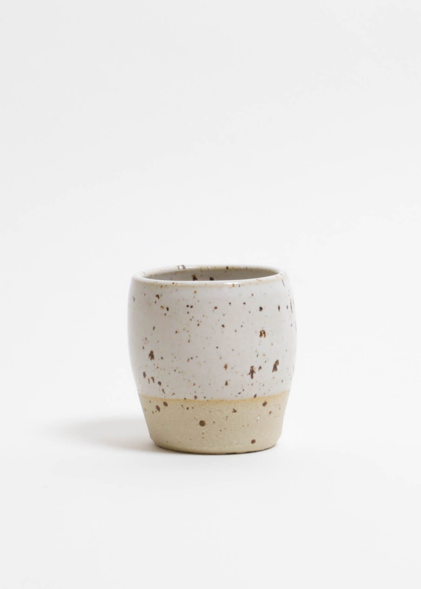
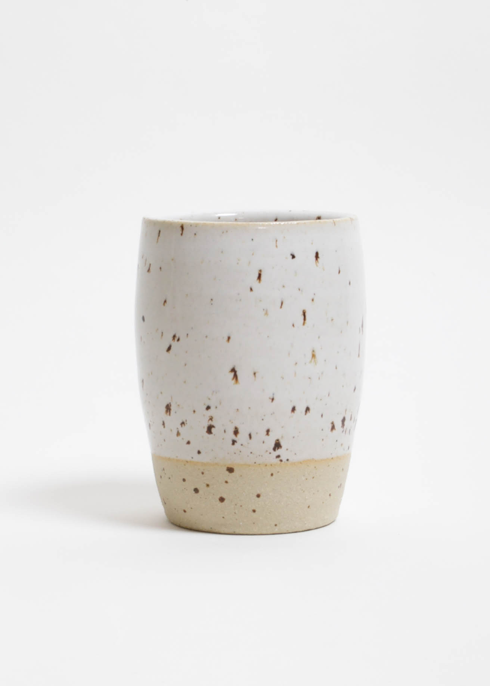
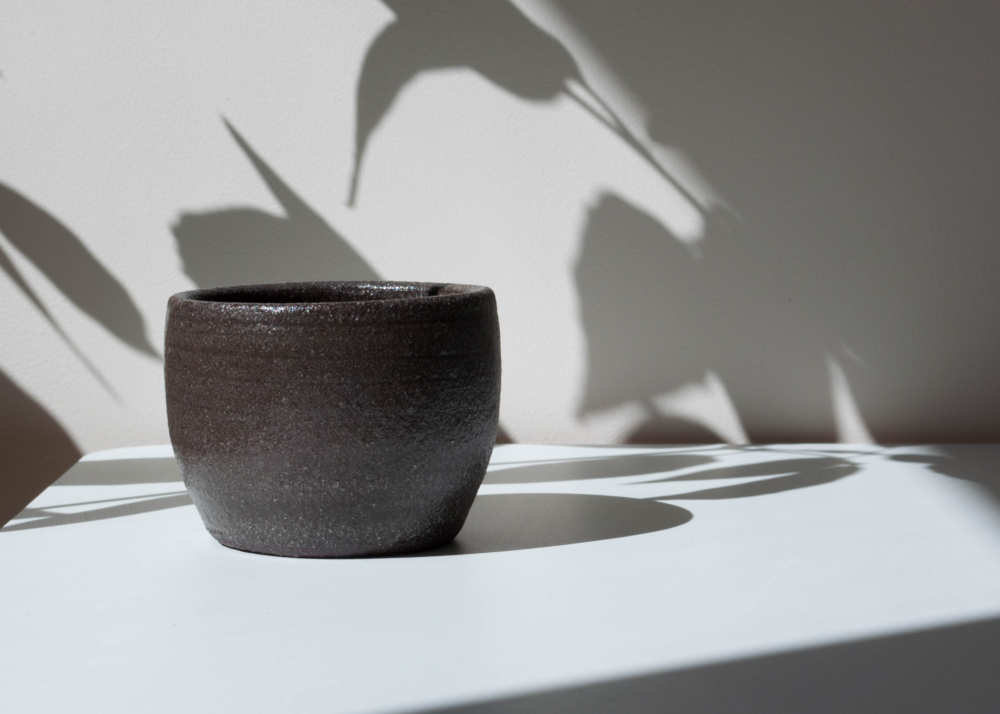
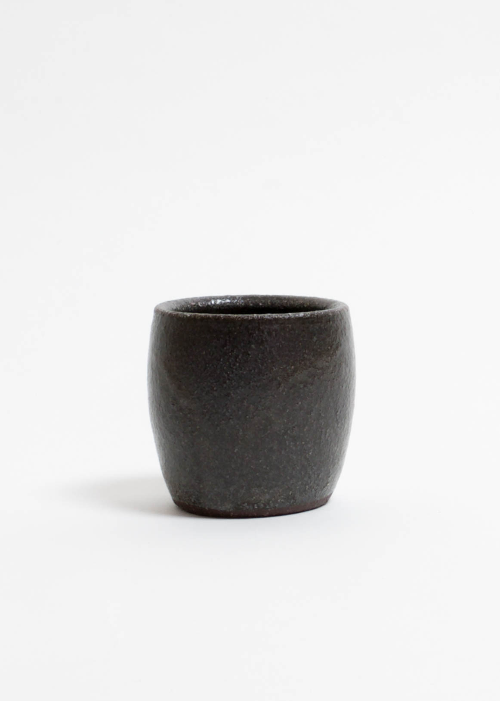
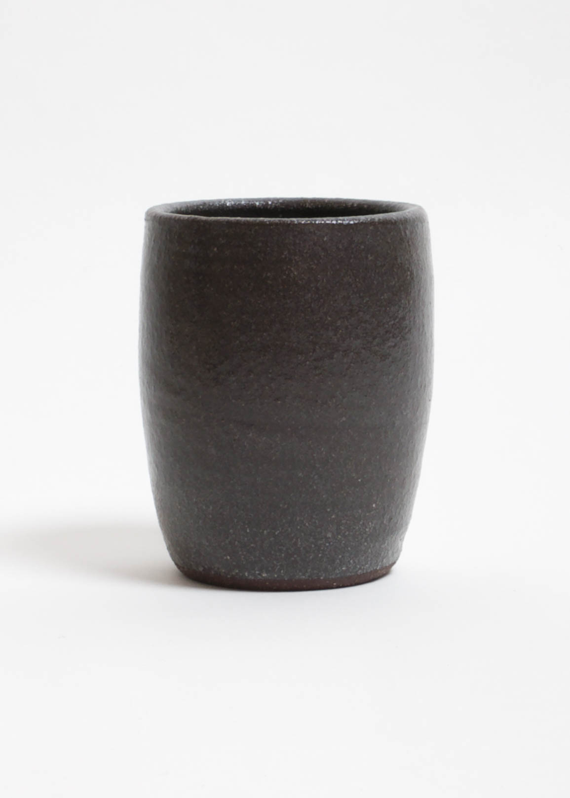

  

    

      

        <h3>Tumblehome Variations</h3>
        

            
Tumblehome is the first collection I created for Studio DOR &
               TAN, inspired by marine architecture. A more in-depth talk about
                this can be found <a href="tumblehome.html">here</a>.

            
The Tumblehome collection was made in one colour, a natural
              white glaze and a sandy hued clay. Designed to be classic and
              tactile in tone and profile. I was asked by DOR & TAN to create
              the same form in different clay and glaze combinations of my own
              choice. Colour is a difficult area when you want to keep a concept
               ageless, so instead I opted for texture first. Often surface is
               underrated and ignored as the soul of a piece when it comes to
               tableware. So I went with a groggy charcoal clay, minimal, simple
                but aesthetically different from the norm. 

            
Another option was pattern, pattern is not seen as minimal, but
              wood, earth, and metal, all have their own subtle unsystematic
              sequences. We don’t consider any of these elements as garish, so
              the answer must be naturally occurring disorder. I wanted to use
              a clay which added pattern organically to a piece, not by my hand
               but reaction. I experimented with a couple of flecked and toasted
                clays for this and found a perfectly balanced fleck in terms of
                negative space, hue and added texture. 

        

      

    

    

      
      

        

        

      

      
      

        

        

      

    

  

