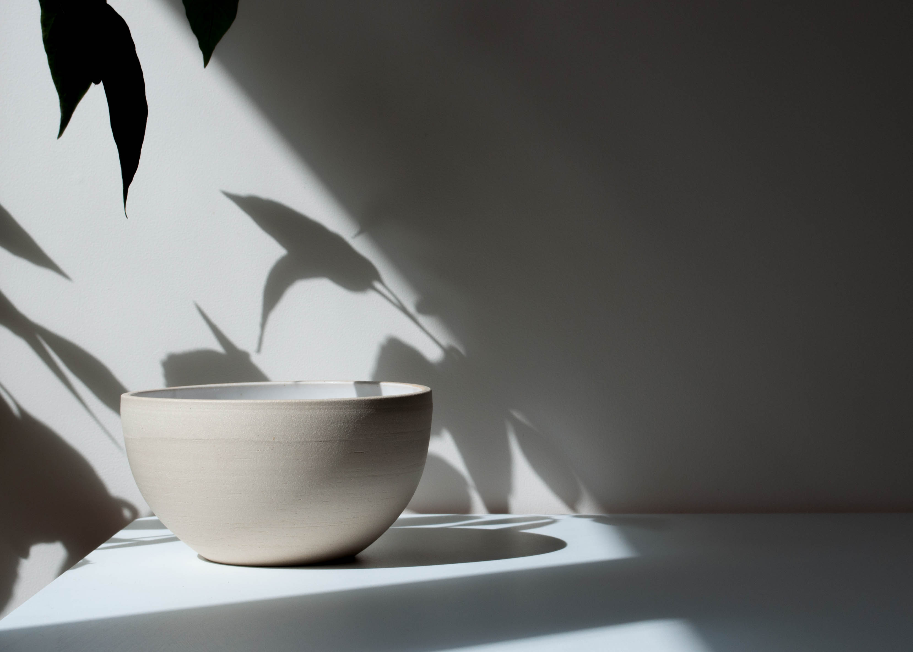
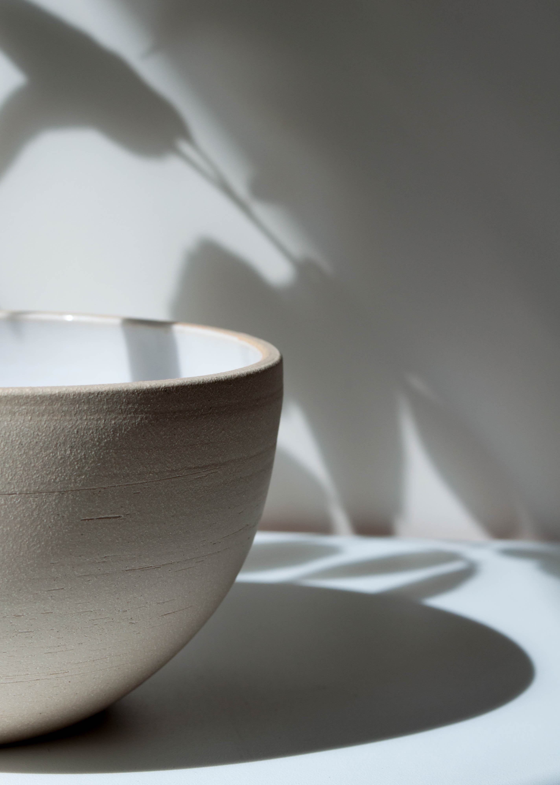
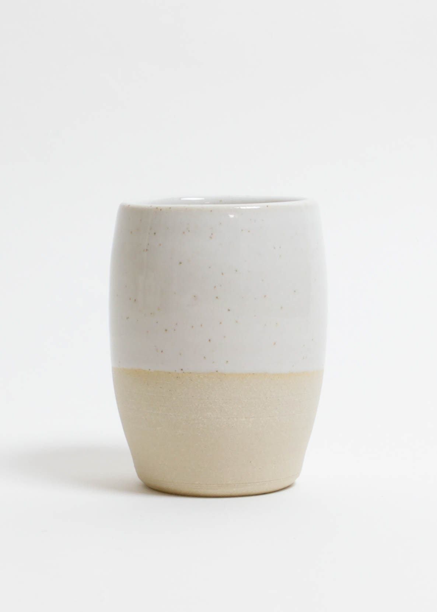
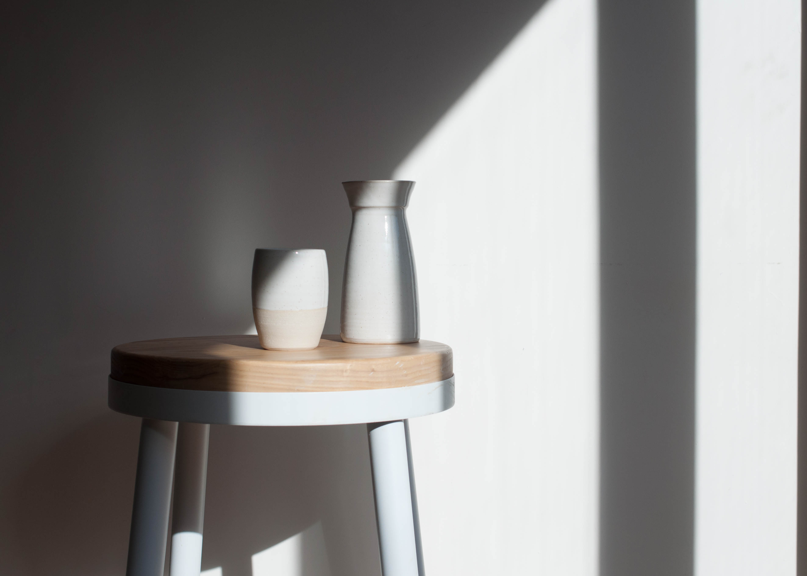
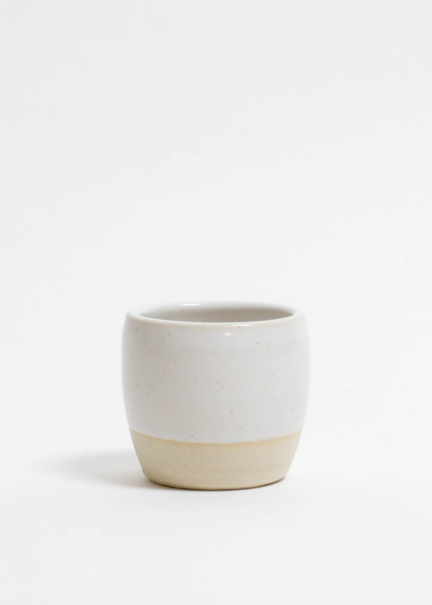
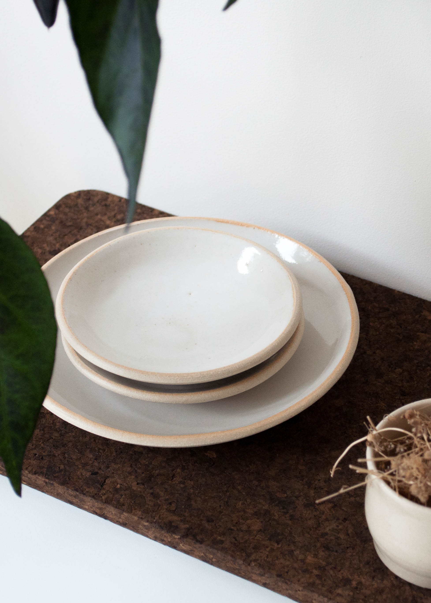
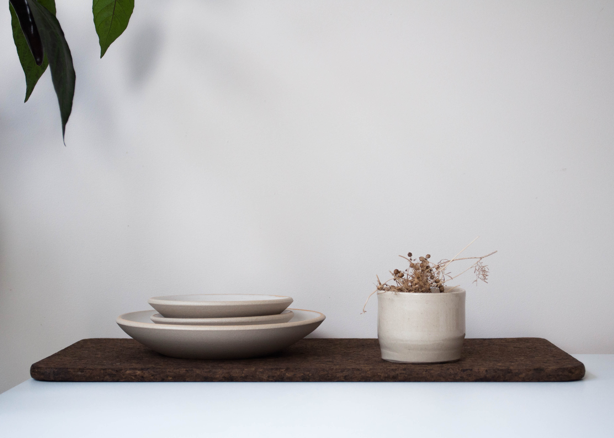

  

    

      

        <h3>Tumblehome</h3>
        

            
My life started beside the ocean, and it has always been a
              neighbour I’ve found myself gravitating back to over the years.
              To me the sea is one of the key elements of living in Cornwall,
              it permeates daily life. It surrounds us, provides for us, and is
               traversed upon.

            
The Tumblehome collection is based on marine architecture, more
              specifically the curvature of boat hulls. The curve of a
              Tumblehome boat is widest at the water line and tapers both above
               and below. I worked with this concept, moving to the notion that
                the sea and the human body are the same curving biological mass
                 that both cup and hold objects in the same way.

              
This idea lead me to design a series of minimal objects with
                these parameters drew me to form tumblers, plates, and bowls.
                Creating a neat, uncluttered and direct connection between
                object and person. But also their simple function and form gave
                 me an outlet to provide people with that same tactile and
                 satisfying experience which working with clay gives me.

        

      

    

    

      
      

        

        

      

      
      

        

        

      

      
    

  

